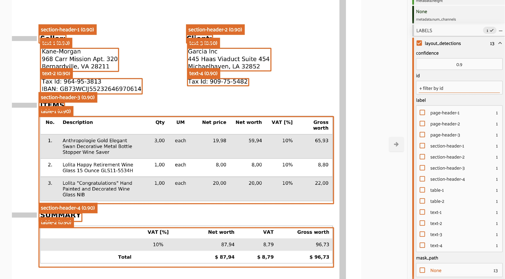

# VLM Run Plugin

A plugin that provides operators for extracting structured data from visual sources using [VLM Run](https://vlm.run)'s vision-language model.


---

## 📋 Table of Contents

- [Overview](#-overview)
- [Features](#-features)
- [Installation](#-installation)
- [Operators](#-operators)
  - [1. Object Detection](#1-object-detection)
  - [2. Person Detection](#2-person-detection)
  - [3. Document Analysis](#3-document-analysis)
  - [4. Invoice Parsing](#4-invoice-parsing)
  - [5. Layout Detection](#5-layout-detection)
  - [6. Video Transcription](#6-video-transcription)
- [Usage](#-usage)
- [Visual Grounding](#-visual-grounding)
- [Supported Formats](#-supported-formats)
- [Configuration](#-configuration)
- [Examples](#-examples)
- [Learn More](#-learn-more)

---

## 🎯 Overview

This plugin integrates VLM Run's state-of-the-art vision-language models with FiftyOne, enabling:

* **🔍 Object Detection**: Detect and localize objects in images
* **👤 Person Detection**: Specialized person detection with enhanced accuracy
* **📄 Document Analysis**: Extract text and analyze document structure
* **💵 Invoice Parsing**: Extract structured data from invoices
* **📐 Layout Detection**: Identify document layout elements
* **🎥 Video Processing**: Transcribe audio and analyze video content

---

## ✨ Features

* **Visual Grounding**: Get bounding box coordinates in normalized xywh format
* **Multi-Modal Support**: Process images, documents, and videos
* **Easy Integration**: Simple API key setup
* **Batch Processing**: Process multiple samples efficiently
* **Flexible Configuration**: Customizable output fields and parameters
* **FiftyOne Native**: Seamless integration with FiftyOne workflows

---

## 📦 Installation

### Prerequisites

* FiftyOne >= 0.20.0
* Python >= 3.8
* VLM Run API Key ([Get yours at vlm.run](https://vlm.run))

### Plugin Installation

1. Download this plugin to your FiftyOne plugins directory:

```shell
fiftyone plugins download \
https://github.com/vlm-run/vlmrun-voxel51-plugin \
--plugin-names @voxel51/vlmrun
```

2. Install the required dependencies:

```shell
fiftyone plugins requirements @voxel51/vlmrun --install
```

3. Set your VLM Run API key:

```shell
export VLM_API_KEY="your_api_key_here"
```

4. Restart your FiftyOne App to load the plugin:

```python
# If FiftyOne is running, restart it
import fiftyone as fo
session = fo.launch_app()
```

---

## 🚀 Operators

This plugin provides six main operators accessible through the FiftyOne App's operator browser (⚡ icon):

### 1. Object Detection


**Operator**: `object_detection`

Detect and localize objects in images with bounding box coordinates.

**Features**:
* Bounding boxes in normalized xywh format
* Confidence scores for each detection
* Support for common object categories
* Visual grounding for precise localization

**Use Case**: Object detection in images for model training, evaluation, and annotation.

---

### 2. Person Detection


**Operator**: `person_detection`

Specialized person detection with enhanced accuracy for human-centric applications.

**Features**:
* High-accuracy person detection
* Optimized for challenging scenarios
* Detailed bounding boxes
* Confidence scores

**Use Case**: Human detection in surveillance, autonomous systems, or crowd analysis.

---

### 3. Document Analysis


**Operator**: `document_analysis`

Extract text and analyze document structure from PDFs and images.

**Features**:
* Text extraction with spatial coordinates
* Document structure analysis
* Paragraph and section detection
* Table and figure identification

**Identifies**:
* Text regions and columns
* Headers, footers, and body text
* Tables and figures
* Bounding boxes for each layout element

**Use Case**: Document digitization, information extraction, and content analysis.

---

### 4. Invoice Parsing


**Operator**: `invoice_parsing`

Extract structured data from invoice documents with visual grounding.

**Features**:
* Automated field extraction
* Visual grounding for each field
* Support for various invoice formats
* Structured output

**Extracts**:
* Invoice totals and line items
* Customer and vendor information
* Payment terms and dates
* Tax and discount information
* Visual grounding for each field (optional)

**Use Case**: Automated invoice processing, accounts payable automation, and financial document analysis.

---

### 5. Layout Detection


**Operator**: `layout_detection`

Analyze document layout and identify structural elements.

**Features**:
* Layout element classification
* Bounding boxes for each element
* Reading order detection
* Column and section identification

**Identifies**:
* Text regions and columns
* Headers, footers, and body text
* Tables and figures
* Images and graphics
* Bounding boxes for each layout element

**Use Case**: Document understanding, layout-aware OCR, and document preprocessing.

#### Example Output


*Document layout detection showing identified text regions, headers, and structural elements with bounding boxes*

---

### 6. Video Transcription


**Operator**: `video_transcription`

Transcribe audio and analyze video content using VLM Run's video understanding capabilities.

**Supported Modes**:
* **Transcription**: Audio-to-text transcription
* **Comprehensive**: Full video analysis (objects, scenes, activities)
* **Objects**: Object detection in video frames
* **Scenes**: Scene classification
* **Activities**: Activity recognition

**Features**:
* High-accuracy transcription
* Multi-modal analysis
* Temporal segmentation
* Contextual understanding

**Use Case**: Video content analysis, accessibility (captions), and content indexing.

---

## 📋 Usage

### Basic Workflow

1. **Load your dataset** in FiftyOne App
2. **Select samples** (optional) - operators work on selection or entire view
3. **Open operator browser** (⚡ icon in the App)
4. **Choose an operator** from the `@voxel51/vlmrun` section
5. **Configure parameters** in the operator form
6. **Execute** immediately or delegate for background processing

### Example: Object Detection

```python
import fiftyone as fo

# Load your dataset
dataset = fo.load_dataset("my_dataset")

# Launch FiftyOne App
session = fo.launch_app(dataset)

# In the App:
# 1. Select samples or use entire view
# 2. Open operator browser (⚡ icon)
# 3. Find "VLM Run: Object Detection"
# 4. Configure parameters (API key, grounding, output field)
# 5. Execute
```

### Example: Document Analysis

```python
# For document analysis:
# 1. Load dataset with document images or PDFs
# 2. Select samples to analyze
# 3. Run "VLM Run: Document Analysis"
# 4. Enable visual grounding for bounding boxes
# 5. Specify output field name
# 6. Execute

# Access results
for sample in dataset:
    if "vlmrun_document" in sample:
        print(f"Document: {sample.filepath}")
        print(f"Analysis: {sample.vlmrun_document}")
```

### Example: Video Transcription

```python
# For video processing:
# 1. Load video dataset
# 2. Select videos to transcribe
# 3. Run "VLM Run: Video Transcription"
# 4. Choose analysis mode (transcription, comprehensive, etc.)
# 5. Execute

# Access transcription
for sample in dataset:
    if "vlmrun_video" in sample:
        print(f"Video: {sample.filepath}")
        print(f"Transcription: {sample.vlmrun_video['transcription']}")
```

---

## 🎨 Visual Grounding

When enabled, visual grounding provides bounding box coordinates for extracted data in **normalized xywh format**:

* `x`: horizontal position of top-left corner (0-1)
* `y`: vertical position of top-left corner (0-1)
* `w`: width of the box (0-1)
* `h`: height of the box (0-1)

This allows for precise localization of detected objects, text regions, or document elements.

---

## 📁 Supported Formats

* **Images**: JPEG, PNG, BMP, TIFF, and other common formats
* **Documents**: PDF, scanned documents, document images
* **Videos**: MP4, AVI, MOV, MKV, WEBM, FLV, WMV, M4V

---

## ⚙️ Configuration

### API Key Setup

To use this plugin, you need a VLM Run API key:

1. Sign up at [vlm.run](https://vlm.run)
2. Get your API key from the dashboard
3. Set it via environment variable or pass directly:

```shell
# Environment variable (recommended)
export VLM_API_KEY="your_api_key_here"

# Or pass in operator parameters
# (see operator UI for api_key field)
```

### Execution Modes

All operators support two execution modes:

* **Immediate**: Process immediately in the FiftyOne App (default)
* **Delegated**: Queue for background processing (requires orchestrator setup)

### Output Field Configuration

All operators allow you to specify custom output field names:

* Default fields: `vlmrun_detections`, `vlmrun_document`, `vlmrun_video`, etc.
* Custom fields: Specify any field name in the operator parameters
* Multiple runs: Use different field names to preserve multiple analyses

---

## 🎯 Examples

### Full Workflow Example

```python
import fiftyone as fo

# Create or load dataset
dataset = fo.Dataset("vlm_demo")
dataset.add_samples_from_dir("/path/to/images")

# Launch app
session = fo.launch_app(dataset)

# Run operators via SDK
# Note: Operators can also be run via the FiftyOne App UI

# 1. Object Detection
# Use operator browser in app, or:
# (API key from environment variable)

# 2. Document Analysis on PDFs
docs = dataset.match(fo.ViewField("filepath").ends_with(".pdf"))
# Run "VLM Run: Document Analysis" from operator browser

# 3. Video Processing
videos = dataset.match(fo.ViewField("media_type") == "video")
# Run "VLM Run: Video Transcription" from operator browser
```

### Integration with Existing Workflows

```python
# Combine with FiftyOne's powerful querying
import fiftyone as fo
import fiftyone.zoo as foz

# Load a dataset
dataset = foz.load_zoo_dataset("quickstart")

# Filter for specific samples
view = dataset.match(fo.ViewField("predictions.detections.label") == "person")

# Run VLM Run person detection on these samples
# 1. Open operator browser
# 2. Select "VLM Run: Person Detection"
# 3. Execute on view

# Compare results
session = fo.launch_app(view)
```

### Batch Processing

```python
# Process large datasets efficiently
import fiftyone as fo

dataset = fo.Dataset("large_dataset")
dataset.add_samples_from_dir("/path/to/large/directory")

# Process in batches using FiftyOne's views
batch_size = 100
for i in range(0, len(dataset), batch_size):
    batch = dataset[i:i+batch_size]
    # Run operators on batch via operator browser
    print(f"Processed batch {i//batch_size + 1}")
```

---

## 🔧 Advanced Features

### Metadata Tracking

Each processed sample includes metadata about VLM Run processing:

```python
# Access processing metadata
for sample in dataset:
    if "metadata" in sample and "vlm_processing" in sample.metadata:
        print(f"Sample: {sample.filepath}")
        print(f"Processing history: {sample.metadata['vlm_processing']}")
```

### Error Handling

The plugin includes robust error handling:

* Invalid file formats are skipped with warnings
* API errors are logged but don't stop processing
* Missing API keys are handled gracefully
* Network timeouts are handled appropriately

### Performance Tips

* Process samples in batches for better efficiency
* Use visual grounding only when needed (faster without)
* Set appropriate output fields to avoid overwriting results
* Use delegated execution for large datasets

---

## 📝 Requirements

### Python Dependencies

```
fiftyone>=0.20.0
requests>=2.25.0
pillow>=8.0.0
numpy>=1.20.0
```

---

## 🏗️ Plugin Structure

```
vlmrun-voxel51-plugin/
├── fiftyone.yml                # Plugin configuration
├── __init__.py                 # Plugin registration
├── utils.py                    # Core utilities and VLM client
├── object_detection.py         # Object detection operator
├── person_detection.py         # Person detection operator
├── document_analysis.py        # Document analysis operator
├── invoice_parsing.py          # Invoice parsing operator
├── layout_detection.py         # Layout detection operator
├── video_transcription.py      # Video transcription operator
├── requirements.txt            # Dependencies
├── README.md                   # This file
├── assets/                     # Example assets
└── gifs/                       # Demo gifs
```

---

## 🔬 Use Cases

### Computer Vision Workflows

* **Dataset Annotation**: Quickly annotate images with object detections
* **Model Evaluation**: Compare VLM Run detections with model predictions
* **Data Exploration**: Understand dataset composition through automated analysis

### Document Processing

* **Invoice Automation**: Extract structured data from invoices at scale
* **Document Digitization**: Convert scanned documents to searchable, structured data
* **Layout Analysis**: Understand document structure for downstream processing

### Video Understanding

* **Content Indexing**: Create searchable transcriptions of video content
* **Accessibility**: Generate captions and descriptions for videos
* **Activity Recognition**: Identify actions and events in video footage

---

## 📚 Learn More

* [VLM Run Documentation](https://docs.vlm.run)
* [FiftyOne Documentation](https://docs.voxel51.com)
* [Plugin Development Guide](https://docs.voxel51.com/plugins/index.html)
* [VLM Run API Reference](https://docs.vlm.run/api)

---

## 🤝 Contributing

Contributions are welcome! Please see our [contributing guidelines](CONTRIBUTING.md) for details.

---

## 📄 License

This plugin is licensed under the MIT License. See [LICENSE](LICENSE) for details.

---

## 🙋 Support

For questions, issues, or feature requests:

* Open an issue on [GitHub](https://github.com/vlm-run/vlmrun-voxel51-plugin/issues)
* Visit [VLM Run Documentation](https://docs.vlm.run)
* Contact: support@vlm.run

---

**Made with ❤️ by the VLM Run Team**